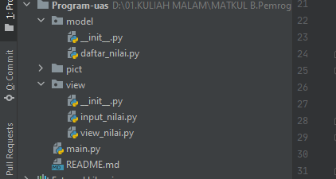

# Program Ujian Akhir Semester 1

Repository ini dibuat untuk memenuhi tugas ujian akhir semester 1  
Nama : Mohamad Farizal Arifin  
NIM : 312010231 
Dosen : Agung Nugroho, M.Kom 
Matkul : Bahasa Pemrograman 
Kelas : TI.20.B.1 

Pada file repository ini saya akan membuat & menjelaskan hasil jawaban program yang sudah saya buat sesuai dengan soal yang diberi oleh dosen, berikut soalnya.   
 
* File package & module yang telah dibuat 
 