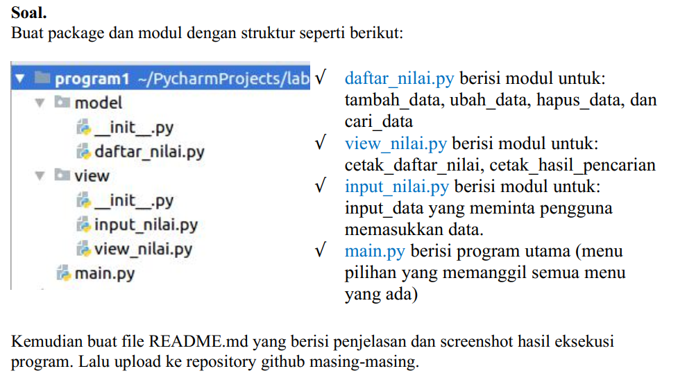
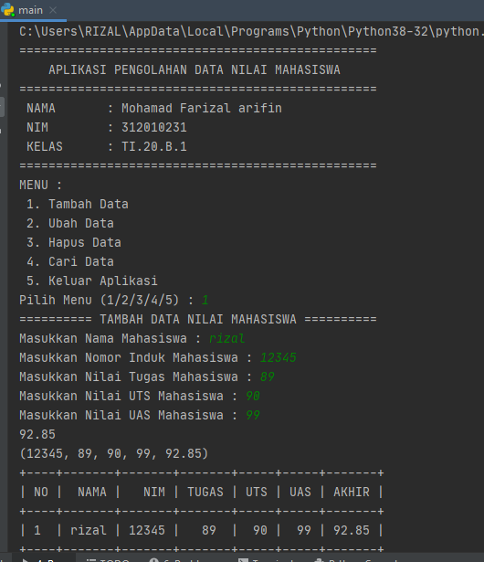

# Program Ujian Akhir Semester 1

Repository ini dibuat untuk memenuhi tugas ujian akhir semester 1<br><br>
Nama : Mohamad Farizal Arifin <br>
NIM : 312010231<br>
Dosen : Agung Nugroho, M.Kom<br>
Matkul : Bahasa Pemrograman<br>
Kelas : TI.20.B.1<br>

Pada file repository ini saya akan membuat & menjelaskan hasil jawaban program yang sudah saya buat sesuai dengan soal yang diberi oleh dosen, berikut soalnya.  <br>
<br>
* File package & module yang telah dibuat<br>
<br>
* Berikut Program daftar_nilai yang telah saya buat<br>
```python
from prettytable import PrettyTable

# Fungsi : tambah_data, ubah_data, hapus_data, cari_data

x = PrettyTable()
tampunglist = {}


def hapus_data(hxsiapa):
    print("========== HAPUS DATA NILAI MAHASISWA ==========")
    if hxsiapa in tampunglist.keys():
        print(f"DATA {hxsiapa} BERHASIL DIHAPUS")
        del tampunglist[hxsiapa]
    else:
        print("!!! === ERROR! DATA TIDAK TERSEDIA === !!!")


def cari_data(csiapa):
    print("========== CARI DATA NILAI MAHASISWA ==========")
    if csiapa in tampunglist.keys():
        print(tampunglist.keys())
        print(tampunglist.items())
        print("Nama\t\t: ", tampunglist[csiapa])
        print("NIM\t\t: ", tampunglist[csiapa][0])
        print("Nilai Tugas\t: ", tampunglist[csiapa][1])
        print("Nilai UTS\t: ", tampunglist[csiapa][2])
        print("Nilai UAS\t: ", tampunglist[csiapa][3])
        print("Nilai Akhir\t: ", tampunglist[csiapa][4])


def ubah_data(xsiapa):
    if xsiapa in tampunglist.keys():
        print("Data apa yang akan diubah ? : ")
        mhs = int(input(" 1. NIM \n 2. Nilai Tugas \n 3. Nilai UTS \n 4. Nilai UAS\n Pilih dengan angka (1/2/3/4) : "))
        if mhs == 1:
            ubahnim = input("Silahkan masukan NIM yang benar : ")
            i = 0
            vtug = tampunglist[xsiapa][1]
            vuts = tampunglist[xsiapa][2]
            vuas = tampunglist[xsiapa][3]
            vakh = tampunglist[xsiapa][4]
            tampunglist[xsiapa] = ubahnim, vtug, vuts, vuas, vakh
            x.field_names = ["No", "NAMA", " NIM", "TUGAS", "UTS", "UAS", "AKHIR"]
            for tdata in tampunglist.items():
                i += 2
                x.add_row([i, tdata[0], tdata[1][0], tdata[1][1], tdata[1][2], tdata[1][3], tdata[1][4]])
            print(x)
        elif mhs == 2:
            ubahtugas = int(input("Masukkan Nilai Tugas yang benar : "))
            i = 0
            vnim = tampunglist[xsiapa][0]
            vuts = tampunglist[xsiapa][2]
            vuas = tampunglist[xsiapa][3]
            vakh = tampunglist[xsiapa][4]
            tampunglist[xsiapa] = vnim, ubahtugas, vuts, vuas, vakh
            x.field_names = ["No", "NAMA", " NIM", "TUGAS", "UTS", "UAS", "AKHIR"]
            for tdata in tampunglist.items():
                i += 2
                x.add_row([i, tdata[0], tdata[1][0], tdata[1][1], tdata[1][2], tdata[1][3], tdata[1][4]])
            print(x)
        elif mhs == 3:
            ubahuts = int(input("Masukkan Nilai UTS yang benar : "))
            i = 0
            vnim = tampunglist[xsiapa][0]
            vtug = tampunglist[xsiapa][1]
            vuas = tampunglist[xsiapa][3]
            vakh = tampunglist[xsiapa][4]
            tampunglist[xsiapa] = vnim, vtug, ubahuts, vuas, vakh
            x.field_names = ["No", "NAMA", " NIM", "TUGAS", "UTS", "UAS", "AKHIR"]
            for tdata in tampunglist.items():
                i += 2
                x.add_row([i, tdata[0], tdata[1][0], tdata[1][1], tdata[1][2], tdata[1][3], tdata[1][4]])
            print(x)
        elif mhs == 4:
            ubahuas = int(input("Masukkan Nilai UAS yang benar : "))
            i = 0
            vnim = tampunglist[xsiapa][0]
            vtug = tampunglist[xsiapa][1]
            vuts = tampunglist[xsiapa][2]
            vakh = tampunglist[xsiapa][4]
            tampunglist[xsiapa] = vnim, vtug, vuts, ubahuas, vakh
            x.field_names = ["No", "NAMA", " NIM", "TUGAS", "UTS", "UAS", "AKHIR"]
            for tdata in tampunglist.items():
                i += 2
                x.add_row([i, tdata[0], tdata[1][0], tdata[1][1], tdata[1][2], tdata[1][3], tdata[1][4]])
            print(x)
        else:
            print("!!! === ERROR! Pilihan yang anda masukan salah === !!!")
    else:
        print("!!! === ERROR! DATA TIDAK TERSEDIA === !!!")
```
* Berikut program input_nilai<br>
```python
from model.daftar_nilai import tampunglist
from prettytable import PrettyTable


# Fungsi : input_data

x = PrettyTable()


def tambah_data():
    print("========== TAMBAH DATA NILAI MAHASISWA ==========")
    tnama = input("Masukkan Nama Mahasiswa : ")
    tnim = int(input("Masukkan Nomor Induk Mahasiswa : "))
    ttugas = int(input("Masukkan Nilai Tugas Mahasiswa : "))
    tuts = int(input("Masukkan Nilai UTS Mahasiswa : "))
    tuas = int(input("Masukkan Nilai UAS Mahasiswa : "))
    takhir = 0.3 * float(ttugas) + 0.35 * float(tuts) + 0.35 * float(tuas)
    print(takhir)
    tampunglist[tnama] = tnim, ttugas, tuts, tuas, takhir
    print(tampunglist[tnama])
    no = 0
    x.field_names = ["NO", "NAMA", " NIM", "TUGAS", "UTS", "UAS", "AKHIR"]
    for tdata in tampunglist.items():
        no += 1
        x.add_row([no, tdata[0], tdata[1][0], tdata[1][1], tdata[1][2], tdata[1][3], tdata[1][4]])
    print(x)
```
* Berikut program view_nilai<br>
```python
```
* Berikut program main.py yang telah saya buat untuk menyatukan package module/sub program atau program utama agar program bisa jalan dengan baik<br>
```python
from model.daftar_nilai import ubah_data, hapus_data, cari_data
from view.input_nilai import tambah_data

print("=================================================")
print("\tAPLIKASI PENGOLAHAN DATA NILAI MAHASISWA\t")
print("=================================================")
print(" NAMA\t\t: Mohamad Farizal arifin\t\t\t")
print(" NIM\t\t: 312010231\t\t\t\t\t\t\t")
print(" KELAS\t\t: TI.20.B.1\t\t\t\t\t\t\t")
print("=================================================")
while True:
    print("MENU : \n 1. Tambah Data \n 2. Ubah Data \n 3. Hapus Data \n 4. Cari Data \n 5. Keluar Aplikasi")
    pilih = int(input("Pilih Menu (1/2/3/4/5) : "))
    if pilih == 1:
        tambah_data()
    elif pilih == 2:
        print("Data siapa yang akan diubah ?")
        siapa = input("Masukkan Nama Mahasiswa yang akan diubah : ")
        ubah_data(xsiapa=siapa)
    elif pilih == 3:
        print("========== HAPUS DATA NILAI MAHASISWA ==========")
        print("Data siapa yang akan diubah ?")
        hsiapa = input("Masukkan Nama Mahasiswa yang akan diubah : ")
        hapus_data(hsiapa)
    elif pilih == 4:
        print(" Pencarian berdasarkan NIM ")
        pencarian = input("Masukkan Nama yang akan dicari : ")
        cari_data(csiapa=pencarian)
    elif pilih == 5:
        print("========== ANDA KELUAR DARI APLIKASI ==========")
        break
    else:
        print("!!! === ERROR! Pilihan yang anda masukan salah === !!!")
```
Berikut ini saya akan menampilkan hasil program atau merunning program yang telah saya buat seperti diatas<br>
* Tambah Data berikut hasilnya <br>
<br>
